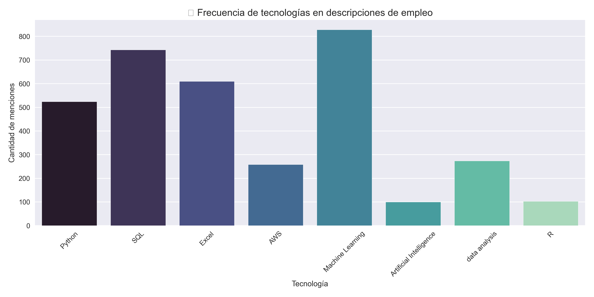

# 🧠 Análisis Salarial en Ciencia de Datos (2024)

Este proyecto analiza **742 descripciones de empleos** en Ciencia de Datos, obtenidas desde Kaggle, para identificar tendencias salariales, tecnologías más demandadas y patrones de oferta laboral.

## 🔍 Objetivos

- Analizar rangos salariales en diferentes posiciones.
- Identificar tecnologías mejor pagadas en el sector.
- Visualizar la frecuencia de herramientas mencionadas en las ofertas.
- Detectar patrones por ubicación, industria y nivel de experiencia.

## 📁 Estructura del proyecto

```
├── data/                         # Archivos de datos (CSV)
├── notebooks/
│   ├── eda-DS.ipynb             # Análisis exploratorio de datos
│   ├── descripciones_empleo.txt # Descripciones de los trabajos (limpias)
│   └── visualizaciones/         # Gráficos generados (.png)
```

## 📊 Tecnologías analizadas

El análisis incluye las siguientes herramientas y tecnologías:

- Python
- SQL
- Excel
- AWS
- Spark
- R
- Machine Learning
- Artificial Intelligence
- Data Analysis

## 🏆 Tecnología mejor pagada

Durante el análisis se compararon los salarios promedios para diferentes tecnologías comunes en Ciencia de Datos. Estos fueron los resultados:

Salario promedio con PYTHON: $112.65
Salario promedio con R: $70.75
Salario promedio con SPARK: $113.35
Salario promedio con AWS: $112.56
Salario promedio con EXCEL: $98.50

🏅 Ganadora:

SPARK con un salario promedio de $113.35 💰

## 📈 Visualizaciones



## 🚀 Cómo ejecutar el proyecto

1. Clona el repositorio:
```bash
git clone https://github.com/TU_USUARIO/analisis-salarial-ds.git
```

2. Instala las dependencias necesarias (recomendado: entorno virtual).
3. Abre el notebook `eda-DS.ipynb` con Jupyter Notebook o VS Code.
4. Ejecuta las celdas y explora los insights 📉📈

## 📌 Fuente de datos

Dataset obtenido desde Kaggle:  
[Data Science Jobs and Salary - Glassdoor (2024)](https://www.kaggle.com/datasets/fahadrehman07/data-science-jobs-and-salary-glassdoor)

## 🧑‍💻 Autor

**Michael [Tu Apellido]**  
[LinkedIn](https://www.linkedin.com/in/tuusuario) | [Portafolio](https://github.com/tuusuario)

