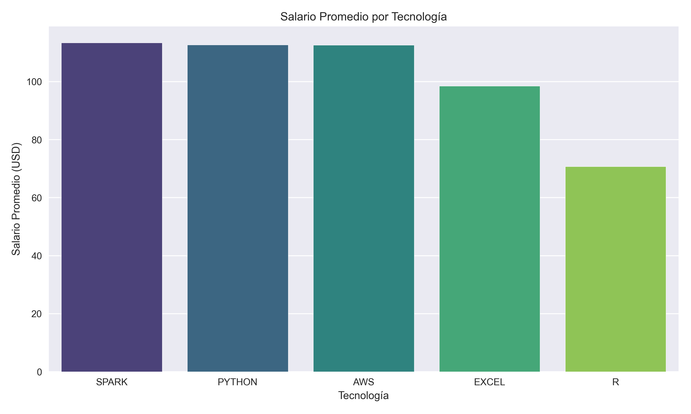

# Análisis Salarial de Empleos en Ciencia de Datos

Este proyecto analiza una base de datos con **742 ofertas de trabajo** en el área de Ciencia de Datos, enfocándose en aspectos como el salario promedio, tecnologías requeridas y descripciones de empleo. Es parte de mi portafolio personal y se encuentra desarrollado en Python, utilizando Jupyter Notebooks.

## 📊 Objetivos del análisis
- Limpiar y explorar el dataset.
- Calcular promedios salariales.
- Identificar tecnologías más comunes.
- Detectar la tecnología mejor pagada.
- Analizar las descripciones de empleo.
- Generar visualizaciones informativas.

## 📁 Estructura del proyecto
```
Analisis-salarial-DS/
│
├── data/
│   └── datos.csv                # Dataset original
│
├── notebooks/
│   ├── eda-DS.ipynb             # Análisis exploratorio y visualizaciones
│   └── descripciones_empleo.txt # Archivo con descripciones de empleos
│   └── visualizaciones/
│       └── tecnologias_frecuencia.png  # Gráfico generado
│
├── README.md                   # Este archivo
```

## 🏆 Tecnología mejor pagada
Durante el análisis se compararon los salarios promedios para diferentes tecnologías comunes en Ciencia de Datos. Estos fueron los resultados:

```
Salario promedio con PYTHON: $112.65
Salario promedio con R: $70.75
Salario promedio con SPARK: $113.35
Salario promedio con AWS: $112.56
Salario promedio con EXCEL: $98.50
```

### 🏅 Ganadora:
**SPARK** con un salario promedio de **$113.35** 💰

### 📊 Salario promedio por tecnología



---

### 📊 Frecuencia de tecnologías en las descripciones de empleo
Este análisis explora la presencia de ciertas tecnologías clave dentro de las descripciones de empleo. Se seleccionaron las siguientes tecnologías:

Python

SQL

Excel

AWS

Machine Learning

Artificial Intelligence

Data Analysis

R

Spark

Para cada una de ellas, se contó cuántas veces aparecían en las descripciones de empleo recopiladas. Esto permite identificar qué habilidades están siendo más demandadas por las empresas.

### 🔍 Resultados de frecuencia

A continuación se muestra un gráfico de barras con la frecuencia de aparición de cada tecnología:


## 🚀 Tecnologías usadas
- Python
- Pandas
- NumPy
- Matplotlib
- Seaborn

## 📌 Notas
- Proyecto realizado con Visual Studio Code
- Control de versiones con Git y GitHub
- Datos obtenidos de Kaggle

## 🔗 Enlace al dataset original
[Glassdoor Data Science Jobs Dataset](https://www.kaggle.com/datasets/fahadrehman07/data-science-jobs-and-salary-glassdoor)

## 📬 Contacto
Si quieres ver más de mi trabajo, visita mi [perfil de GitHub](https://github.com/jetmike01).


